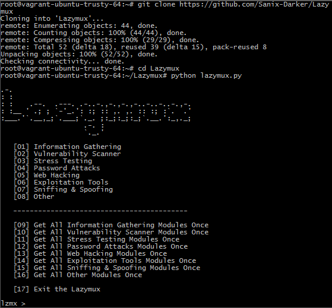

# Lazymux
Lazymux tools installer is very easy to use, only provided for lazy termux users; it's huge list of Many Hacking tools and PEN TESTING!
**NOTE: Am not Responsible of bad use of this project.**

## Install For Termux

• apt update && apt upgrade && pkg install git && pkg install python2

• ```shell
git clone https://github.com/hazelduo/LazyMux
 
• cd LazyMux

python2 lazymux.py
# only python2 working 
python lazymux.py

### Screanshot


#### Requirements
• Linux environment<br>
• Python 2.x<br>
• git<br>

##### Installation and Using Lazymux
```shell
git clone https://github.com/hazelduo/LazyMux
 
cd Lazymux

python2 lazymux.py
# only python2 working 
python lazymux.py
```

###### Authors
• [hazelduo](https://github.com/hazelduo)

###### Contributors
• [hazelduo](https://github.com/hazelduo)
